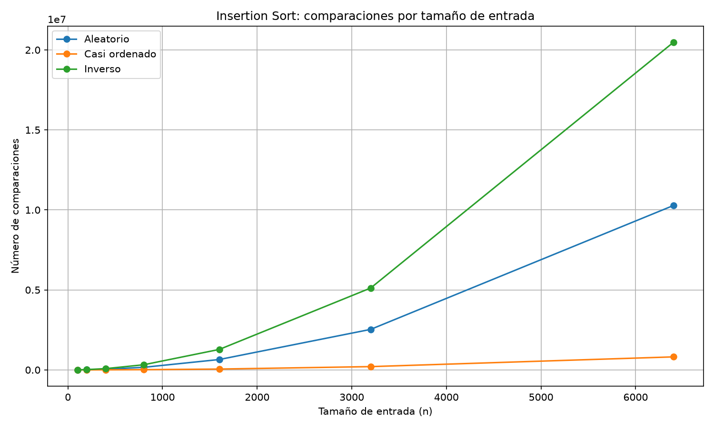
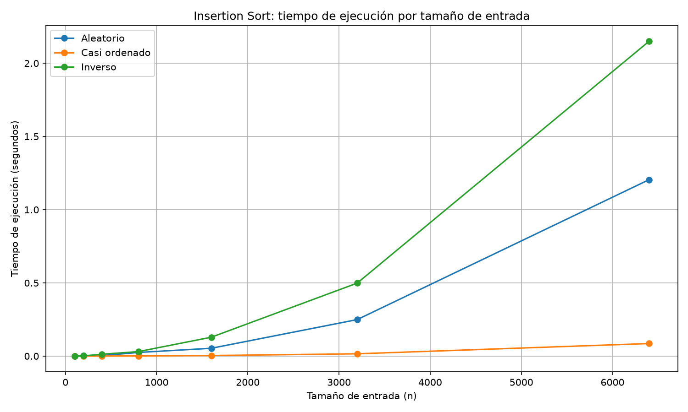
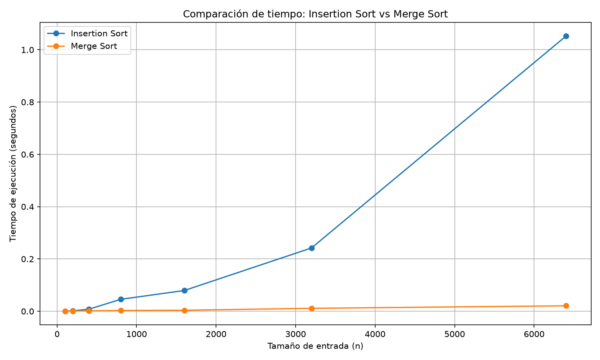

# Laboratorio evaluativo 01 — Fundamentos, complejidad y recurrencias

**Estudiante:** Wilmar Fonseca

## Reproducción del laboratorio

El laboratorio fue desarrollado en Python utilizando un entorno virtual y la biblioteca `matplotlib`.

### Activar el entorno virtual

Desde la raíz del repositorio:

```bash
.venv\Scripts\activate
```

### Ejecutar Parte 3

```bash
python laboratorios/lab1-fundamentos-complejidad-recurrencias/parte3_casos.py
```

Este comando ejecuta las pruebas de Insertion Sort para los tres escenarios y genera:

* `graficas/parte3_comparaciones.png`
* `graficas/parte3_tiempo.png`

### Ejecutar Parte 4

```bash
python laboratorios/lab1-fundamentos-complejidad-recurrencias/parte4_complejidad.py
```

Este comando compara los tiempos de Insertion Sort y Merge Sort y genera:

* `graficas/parte4_tiempo.png`

Los algoritmos implementados se encuentran en [`algoritmos.py`](algoritmos.py) y los generadores de datos en [`datos.py`](datos.py).

---

# Parte 1 — Analizar el algoritmo antes de comprar hardware

En el caso de la plataforma Tamiza es importante analizar primero el algoritmo porque que un algoritmo sea correcto no significa que siga siendo viable cuando aumenta considerablemente la cantidad de datos.

El algoritmo actual de Insertion Sort puede producir una lista correctamente ordenada y durante varios años pudo cumplir con el proceso. Sin embargo, la situación cambió porque ahora debe procesar 1.200.000 registros dentro de una restricción concreta de tiempo: entre las 2:00 a. m. y las 6:00 a. m. La ventana disponible es de solamente cuatro horas y no se puede ampliar.

La eficiencia debe analizarse teniendo en cuenta el recurso que se consume y la restricción que debe cumplirse. En este caso el recurso principal es el tiempo de procesamiento. Aunque el algoritmo siga entregando una lista correcta, si tarda más de cuatro horas deja de ser viable para el proceso de producción.

Duplicar la velocidad del servidor puede disminuir el tiempo de ejecución, pero no cambia la forma en que crece el número de operaciones del algoritmo. Insertion Sort tiene un comportamiento cuadrático en sus casos desfavorables, por lo que cuando aumenta mucho la cantidad de registros el número de operaciones crece rápidamente. Por esta razón, aumentar solamente la velocidad del hardware no soluciona la causa principal del problema.

Un ejemplo diferente sería un sistema de inventario tecnológico que tenga que ordenar aproximadamente 100.000 equipos para generar reportes y asignaciones. Si el algoritmo utilizado requiere una cantidad de operaciones que crece cuadráticamente, el proceso puede tardar demasiado y superar la ventana disponible para generar el reporte antes del inicio de la jornada laboral. El algoritmo puede ser correcto y entregar los datos ordenados, pero no cumplir la restricción de tiempo del proceso.

Por esto, antes de invertir en hardware es necesario analizar el comportamiento del algoritmo y determinar si su crecimiento permite cumplir la restricción de cuatro horas con el volumen actual y futuro de datos.

---

# Parte 2 — Responsabilidad ambiental y ética de la implementación

El tiempo de ejecución de un algoritmo también tiene una relación con el consumo de recursos. Una ejecución que necesita más tiempo mantiene el servidor trabajando durante más tiempo y, por lo tanto, puede aumentar el consumo de energía. En Tamiza el proceso se ejecuta durante la noche y debe repetirse de manera frecuente. Si el algoritmo mantiene un comportamiento costoso durante años, el impacto no corresponde solamente a una ejecución, sino a la acumulación de muchas ejecuciones.

La decisión también tiene una responsabilidad ética porque los registros representan personas que esperan ser contactadas de acuerdo con su nivel de riesgo.

Un primer impacto puede presentarse sobre un paciente con un nivel de riesgo alto. Si el proceso no termina antes de las 6:00 a. m. o genera una lista incompleta, ese paciente podría no aparecer oportunamente en la lista de llamadas. El costo lo asume principalmente el paciente, porque puede existir un retraso en la atención o en el contacto que se esperaba realizar.

Un segundo impacto puede presentarse sobre el operador del call center. Si la lista no queda ordenada correctamente por nivel de riesgo, el operador puede comenzar a llamar a personas con menor prioridad mientras otras con mayor riesgo todavía están pendientes. En este caso el costo recae sobre el operador porque debe trabajar con información incompleta o incorrecta y posiblemente realizar reprocesos.

También existe un costo para la Secretaría de Salud. Si el proceso falla de manera repetida, puede ser necesario reprocesar información, revisar resultados y dedicar recursos técnicos adicionales para solucionar el problema.

Finalmente, el equipo de desarrollo también asume un costo cuando una solución que ya no escala obliga a realizar correcciones urgentes o mantener una implementación que no responde al crecimiento de los datos.

Existe además una responsabilidad sobre el orden de la lista. No se trata solamente de obtener una lista ordenada, porque el orden determina quién será llamado primero. En este escenario, una decisión técnica sobre el algoritmo puede influir directamente en la prioridad con la que las personas reciben el contacto.

Por esta razón, la selección del algoritmo debe considerar el tiempo, el consumo de recursos, la confiabilidad del proceso y las consecuencias que puede tener una ejecución incompleta o incorrecta.

---

# Parte 3 — Peor caso, mejor caso y caso promedio, demostrados en Python

Código utilizado en esta parte: [`parte3_casos.py`](parte3_casos.py)

Los algoritmos y generadores utilizados en esta parte se encuentran en [`algoritmos.py`](algoritmos.py) y [`datos.py`](datos.py).

## 3.1 — Peor caso, mejor caso y caso promedio

Para un tamaño fijo `n`, el **peor caso** corresponde al conjunto de entradas que produce el mayor costo de ejecución del algoritmo.

El **mejor caso** corresponde al conjunto de entradas del mismo tamaño `n` que produce el menor costo de ejecución.

El **caso promedio** representa el comportamiento esperado considerando las entradas posibles del mismo tamaño bajo una distribución determinada.

Para Tamiza no se debe seleccionar el algoritmo pensando únicamente en el mejor caso. Como la ventana de procesamiento es estricta y el proceso debe terminar antes de las 6:00 a. m., se debe considerar un comportamiento que permita responder correctamente incluso cuando la entrada sea desfavorable.

Por esta razón, el criterio de producción debe considerar principalmente el peor caso y la capacidad del algoritmo para mantener un crecimiento controlado cuando aumenta el número de registros.

### Predicción antes de realizar las mediciones

Para Insertion Sort se esperaba el siguiente comportamiento:

* **Escenario A — Aleatorio:** comportamiento cercano al caso promedio.
* **Escenario B — Casi ordenado:** comportamiento cercano al mejor caso.
* **Escenario C — Inverso:** comportamiento correspondiente al peor caso.

La predicción se realizó antes de ejecutar las mediciones.

En el escenario B, el conjunto contiene el 98 % de los datos ordenados y el 2 % de nuevos registros agregados al final. Por esta razón se aproxima al mejor caso, aunque el mejor caso exacto sería una entrada completamente ordenada en el sentido requerido por el algoritmo.

## Resultados experimentales

Se utilizaron los tamaños:

`100, 200, 400, 800, 1600, 3200 y 6400`

El tiempo se midió utilizando `time.perf_counter()` y solamente se midió la ejecución del algoritmo. La generación de los datos se realizó antes de iniciar el cronómetro.

### Comparaciones



### Tiempo de ejecución



## 3.2 — Análisis de los resultados

Los resultados de las comparaciones muestran diferencias claras entre los tres escenarios.

En el escenario B, correspondiente a la entrada casi ordenada, el número de comparaciones crece mucho menos que en los escenarios A y C. Para `n = 6400`, se obtuvieron:

* Aleatorio: `10.276.753` comparaciones.
* Casi ordenado: `813.455` comparaciones.
* Inverso: `20.476.800` comparaciones.

El escenario C presenta el mayor número de comparaciones y también el mayor tiempo de ejecución, por lo que corresponde al comportamiento esperado para el peor caso de Insertion Sort.

El escenario A presenta un comportamiento intermedio y representa el comportamiento esperado para entradas aleatorias.

El escenario B presenta el menor costo de los tres escenarios medidos y se aproxima al mejor caso debido a que la mayor parte de los datos ya se encuentra ordenada.

Los resultados experimentales coinciden con la predicción realizada antes de las mediciones.

---

# Parte 4 — Complejidad de Merge Sort e Insertion Sort: cálculo y validación

Código utilizado en esta parte: [`parte4_complejidad.py`](parte4_complejidad.py)

Los algoritmos utilizados se encuentran en [`algoritmos.py`](algoritmos.py) y los datos de prueba en [`datos.py`](datos.py).

## 4.1 — Complejidad teórica

### Merge Sort

La recurrencia de Merge Sort es:

`T(n) = 2T(n/2) + Θ(n)`

Cada término representa:

* `2T(n/2)`: se realizan dos llamadas recursivas y cada una procesa aproximadamente la mitad de los datos.
* `Θ(n)`: corresponde al costo de combinar las dos partes ordenadas.
* `T(n)`: representa el tiempo total necesario para procesar una entrada de tamaño `n`.

### Resolución mediante el Teorema Maestro

La forma general es:

`T(n) = aT(n/b) + f(n)`

En este caso:

`a = 2`

`b = 2`

`f(n) = Θ(n)`

Calculamos:

`n^(log₂ 2) = n`

Por lo tanto:

`f(n) = Θ(n)`

y:

`f(n) = Θ(n^(log₂ 2))`

Se cumple la condición correspondiente al caso en el que `f(n)` tiene el mismo orden que `n^(log₂ b)`.

Por lo tanto:

`T(n) = Θ(n log n)`

Así, Merge Sort tiene un crecimiento `Θ(n log n)` en sus casos de entrada.

### Análisis manual de Insertion Sort

Para analizar Insertion Sort se consideran las principales operaciones realizadas por el algoritmo y la cantidad de veces que pueden ejecutarse.

| Operación                      | Cantidad aproximada de ejecuciones en el peor caso |       Costo |
| ------------------------------ | -------------------------------------------------: | ----------: |
| Copia de la lista              |                                                `n` |       `c₁n` |
| Inicialización del ciclo `for` |                                            `n - 1` | `c₂(n - 1)` |
| Asignación de `clave`          |                                            `n - 1` | `c₃(n - 1)` |
| Asignación de `j`              |                                            `n - 1` | `c₄(n - 1)` |
| Comparación del `while`        |                                 hasta `n(n - 1)/2` |      `c₅n²` |
| Movimiento de elementos        |                                 hasta `n(n - 1)/2` |      `c₆n²` |
| Disminución de `j`             |                                 hasta `n(n - 1)/2` |      `c₇n²` |
| Asignación final de `clave`    |                                            `n - 1` | `c₈(n - 1)` |

En el peor caso, cada nuevo elemento debe compararse con todos los elementos que ya se encuentran en la parte ordenada. Por eso aparece la suma:

`1 + 2 + 3 + ... + (n - 1)`

La suma de los primeros `n - 1` números es:

`n(n - 1) / 2`

Al desarrollar:

`(n² - n) / 2`

Por lo tanto, las operaciones que dependen de esta suma crecen proporcionalmente a `n²`.

La suma general de los costos puede representarse como:

`T(n) = c₁n + c₂(n - 1) + c₃(n - 1) + c₄(n - 1) + c₅n² + c₆n² + c₇n² + c₈(n - 1)`

Los términos lineales y constantes tienen menor crecimiento que los términos cuadráticos. Por eso, al conservar el término dominante:

`T(n) = Θ(n²)`

En el mejor caso, cuando los datos ya están ordenados en el sentido requerido, el ciclo interno realiza aproximadamente una comparación por elemento y no necesita desplazar los elementos.

En ese caso el número de operaciones crece proporcionalmente a `n`, por lo que:

`T(n) = Θ(n)`

El caso promedio mantiene un crecimiento cuadrático:

`T(n) = Θ(n²)`

Por tanto, la complejidad de Insertion Sort queda:

| Caso          | Complejidad |
| ------------- | ----------: |
| Mejor caso    |      `Θ(n)` |
| Caso promedio |     `Θ(n²)` |
| Peor caso     |     `Θ(n²)` |

---

## 4.2 — Validación experimental

Se compararon Insertion Sort y Merge Sort utilizando el escenario A, con los mismos tamaños empleados en la Parte 3.

Los tiempos se midieron utilizando `time.perf_counter()`.



A medida que aumenta `n`, la diferencia entre los dos algoritmos se hace cada vez mayor.

Para `n = 6400`, los resultados de la última medición fueron:

* Insertion Sort: `1,052141 segundos`
* Merge Sort: `0,020916 segundos`

En esta medición, Merge Sort fue aproximadamente **50 veces más rápido** que Insertion Sort.

La curva de Insertion Sort crece mucho más rápidamente a medida que aumenta el tamaño de entrada, mientras que Merge Sort mantiene un crecimiento considerablemente menor.

La conclusión experimental coincide con el análisis teórico. Insertion Sort presenta un crecimiento cuadrático en el escenario aleatorio, mientras que Merge Sort presenta un crecimiento `Θ(n log n)`.

En los tamaños utilizados en esta prueba, Merge Sort presentó un mejor tiempo de ejecución que Insertion Sort, aunque en tamaños muy pequeños la diferencia puede ser reducida debido al costo adicional de la recursividad y la combinación de datos.

---

# 4.3 — Concepto técnico a la Secretaría de Salud

**Para:** Equipo de ingeniería de la Secretaría de Salud
**Asunto:** Recomendación de algoritmo para el procesamiento de registros de la plataforma Tamiza

Se recomienda reemplazar Insertion Sort por Merge Sort para el proceso nocturno de ordenamiento de los registros de Tamiza.

El criterio principal de selección debe ser el comportamiento del algoritmo cuando cambia el tipo de entrada. La plataforma recibe información de diferentes fuentes y el orden de los datos puede cambiar sin previo aviso. Por esta razón, no resulta conveniente mantener tres implementaciones diferentes dependiendo de si los datos llegan aleatorios, casi ordenados o en orden inverso. Se recomienda utilizar un algoritmo cuyo comportamiento tenga un crecimiento más controlado frente a estos cambios.

Las mediciones realizadas muestran una diferencia importante. Con 6.400 registros del escenario A, Insertion Sort tardó `1,052141 segundos`, mientras que Merge Sort tardó `0,020916 segundos`. Esto significa que, en esta medición, Merge Sort fue aproximadamente 50 veces más rápido.

Para estimar el comportamiento con los 1.200.000 registros de producción se utiliza como referencia la medición de 6.400 registros y el crecimiento teórico de cada algoritmo. Para Insertion Sort, considerando un crecimiento cuadrático, se obtiene una estimación de aproximadamente `36.989 segundos`, equivalentes a **10,27 horas**. Esta cifra es una extrapolación y no una medición directa con 1.200.000 registros. Incluso considerando únicamente una entrada aleatoria, la estimación supera ampliamente la ventana disponible de cuatro horas.

Para Merge Sort, utilizando como referencia los `0,020916 segundos` obtenidos con 6.400 registros y considerando un crecimiento `n log n`, la estimación para 1.200.000 registros es de aproximadamente **6,26 segundos**. Esta cifra también corresponde a una extrapolación y no a una medición directa sobre el volumen de producción.

Estos resultados muestran que duplicar la velocidad del servidor no soluciona la causa principal. La última medición muestra que Insertion Sort necesita `1,052141 segundos` para 6.400 registros, mientras que Merge Sort necesita solamente `0,020916 segundos`. Aunque un servidor más rápido reduzca parte de estos tiempos, Insertion Sort mantiene un crecimiento cuadrático y la cantidad de datos de producción es mucho mayor.

Además del tiempo, se debe considerar el mantenimiento de la solución. Merge Sort requiere memoria adicional para realizar las divisiones y combinaciones de los datos. Sin embargo, este costo debe compararse con el riesgo operativo de depender de que el escenario B continúe siendo casi ordenado. Si en algún momento cambia la forma de entrada y los datos llegan en un orden desfavorable, Insertion Sort puede aumentar considerablemente su tiempo de procesamiento.

Por lo anterior, se recomienda implementar Merge Sort como la solución única para el ordenamiento de los registros antes de generar la lista de llamadas. Esta alternativa ofrece un crecimiento `Θ(n log n)` y reduce considerablemente el riesgo de que el cambio en el tipo de entrada provoque que el proceso supere la ventana de cuatro horas.
