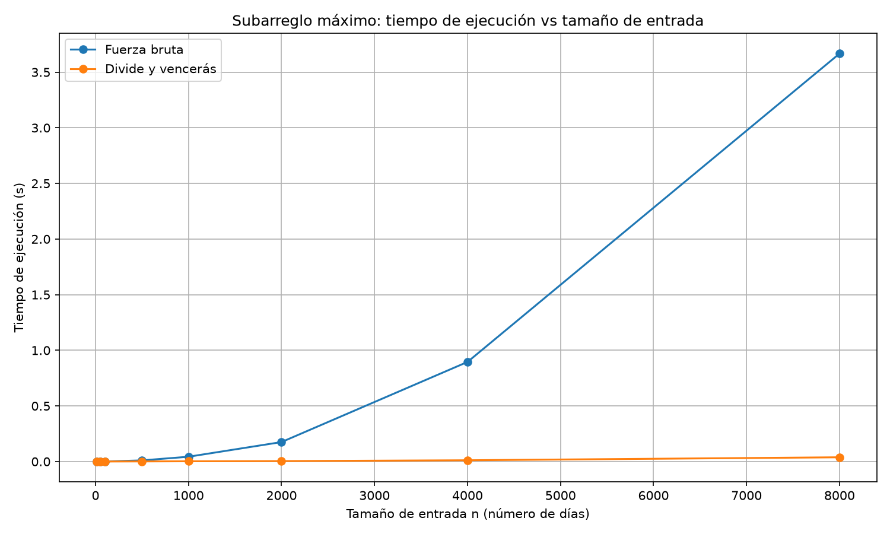
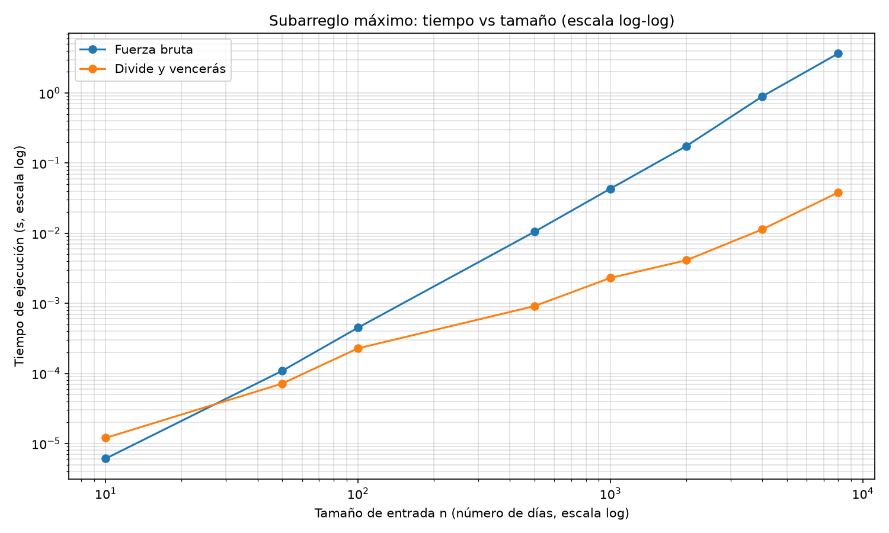

# Laboratorio evaluativo 02 — Dividir y vencer

**Estudiante:** Wilmar Fonseca García

## Reproducción del laboratorio

Todos los comandos se ejecutan desde la raíz del repositorio.

### Activar el entorno virtual

En Windows:

```bash
.venv\Scripts\activate
```

En macOS o Linux:

```bash
source .venv/bin/activate
```

Si falta `matplotlib`:

```bash
pip install -r requirements.txt
```

### Ejecutar las pruebas

```bash
python laboratorios/lab2-divide-y-vencer/pruebas.py
```

Si todo está bien, imprime `Todas las pruebas pasaron correctamente.`

### Ejecutar la medición y generar las gráficas

```bash
python laboratorios/lab2-divide-y-vencer/medicion.py
```

Imprime los tiempos, la tabla de resultados y los factores de crecimiento al
duplicar `n`, y genera `graficas/tiempo_vs_n.png` y
`graficas/tiempo_vs_n_loglog.png`. Con la opción `--millon` mide además
divide y vencerás con 1.000.000 de registros (la fuerza bruta se omite porque
tardaría horas).

---

# Parte 1 — Implementar y verificar las dos soluciones

Código: [`subarreglo.py`](subarreglo.py) y [`pruebas.py`](pruebas.py)

Se implementaron `subarreglo_fuerza_bruta` (Θ(n²), acumulando la suma en el
ciclo interno), `suma_cruzada` (barrido lineal desde el punto medio hacia cada
lado) y `subarreglo_maximo` (divide y vencerás con los tres casos: izquierdo,
derecho y cruzado, sin llamar a la fuerza bruta). Ninguna función modifica la
lista recibida.

La verificación está en `pruebas.py`, que se ejecuta con `assert` y cubre:

- la serie de ocho días del enunciado (suma 17);
- una serie de un solo elemento;
- una serie con todos los valores negativos (la mejor racha es el elemento
  menos negativo);
- una serie con todos los valores positivos (la mejor racha es la serie
  completa);
- un caso cuyo mejor tramo cruza el punto medio, comprobando también
  `suma_cruzada` de forma directa;
- que ninguna función modifica la lista recibida;
- que los índices devueltos suman realmente el valor devuelto;
- 50 listas aleatorias (semilla fija) en las que ambos algoritmos dan la misma
  suma. Las pruebas comparan la suma y no los índices, porque si hay empates
  cualquier tramo es válido.

---

# Parte 2 — Medir y graficar

Código: [`medicion.py`](medicion.py)

**Cómo se midió.** Se midieron 8 tamaños: 10, 50, 100, 500, 1000, 2000, 4000
y 8000. Para cada tamaño se genera una lista de enteros entre -100 y 100 con
semilla fija (`20261009 + índice del tamaño`) y se usa **la misma lista** en
ambos algoritmos. El cronómetro (`time.perf_counter()`) rodea solo la llamada
al algoritmo, nunca la generación de datos. Cada medición se repite 3 veces y
se reporta el promedio. Dentro del propio experimento se verifica, para cada
tamaño, que ambos algoritmos devuelven la misma suma.



En escala lineal la curva de divide y vencerás queda pegada al eje
horizontal, así que se agrega la misma gráfica con ambos ejes en escala
logarítmica, donde sí se distinguen los tamaños pequeños:



Tiempos medidos en esta corrida (promedio de 3 repeticiones, en segundos):

| n | Fuerza bruta (s) | Divide y vencerás (s) |
|---:|---:|---:|
| 10 | 0.000006 | 0.000012 |
| 50 | 0.000109 | 0.000072 |
| 100 | 0.000450 | 0.000228 |
| 500 | 0.010475 | 0.000912 |
| 1000 | 0.043147 | 0.002304 |
| 2000 | 0.175065 | 0.004114 |
| 4000 | 0.895270 | 0.011361 |
| 8000 | 3.666807 | 0.038243 |

Factor por el que se multiplica el tiempo cuando `n` se duplica, medido y
esperado según la complejidad teórica (Θ(n²) predice 4; Θ(n log n) predice
`2·log₂(2n)/log₂(n)`):

| n1 → n2 | FB medido | FB esperado Θ(n²) | DV medido | DV esperado Θ(n log n) |
|---|---:|---:|---:|---:|
| 50 → 100 | 4.14 | 4.00 | 3.19 | 2.35 |
| 500 → 1000 | 4.12 | 4.00 | 2.52 | 2.22 |
| 1000 → 2000 | 4.06 | 4.00 | 1.79 | 2.20 |
| 2000 → 4000 | 5.11 | 4.00 | 2.76 | 2.18 |
| 4000 → 8000 | 4.10 | 4.00 | 3.37 | 2.17 |

Los tiempos de divide y vencerás son de pocos milisegundos o menos, por lo que
las mediciones tienen ruido del sistema operativo; por eso los factores de
esa columna varían más que los de la fuerza bruta.

---

# Parte 3 — Análisis

## 1. Recurrencia

El algoritmo `subarreglo_maximo` divide la lista en dos mitades y realiza dos llamadas recursivas sobre listas de tamaño aproximado n/2. Después calcula el máximo que cruza ambas mitades mediante `suma_cruzada`, que recorre los elementos de los dos lados y cuesta Θ(n). Por eso, la recurrencia es T(n) = 2T(n/2) + Θ(n). Aplicando el método maestro, a = 2, b = 2 y f(n) = Θ(n). Como n^(log₂ 2) = n, ambos términos crecen al mismo ritmo y se aplica el caso 2, obteniendo Θ(n log n). La fuerza bruta tiene complejidad Θ(n²), porque prueba n(n+1)/2 pares de índices y acumula la suma en el ciclo interno, por lo que cada elemento nuevo requiere una sola suma.

## 2. Lo medido contra lo esperado

Cuando aumenta el tamaño de la entrada, la curva de fuerza bruta crece más rápido que la de divide y vencerás. Para n = 8000, la primera tarda 3,666807 s y la segunda 0,038243 s. Al pasar de 1000 a 2000 registros, los tiempos se multiplicaron por 4,06 y 1,79, respectivamente. La teoría predice factores de 4 para Θ(n²) y aproximadamente 2,20 para Θ(n log n). Por tanto, fuerza bruta coincide bastante bien con lo esperado, mientras que divide y vencerás presenta variaciones: su factor fue menor en ese intervalo y llegó a 3,37 entre 4000 y 8000. Entre n = 1000 y n = 8000, el tiempo de divide y vencerás se multiplicó por 16,6. Como Θ(n log n) predice ≈ 10,4 y Θ(n²) predice 64, mis datos concuerdan mejor con Θ(n log n).

## 3. Tamaños pequeños

Con n = 10, fuerza bruta fue más rápida, con 6 µs frente a 12 µs de divide y vencerás. Para n = 50, los resultados cambiaron: fuerza bruta tardó 109 µs y divide y vencerás 72 µs. La fuerza bruta puede ganar con listas pequeñas porque evita el costo extra de las llamadas recursivas, el barrido del caso cruzado y la combinación de resultados. En la gráfica log-log, las curvas se cruzan entre n = 10 y n = 50, mostrando el cambio de rendimiento.

## 4. ¿Cuándo conviene dividir?

Si busco el máximo de una lista, dividirla no mejora el rendimiento frente a recorrerla una vez, porque igualmente debo revisar todos los elementos. Combinar los máximos de las dos mitades cuesta Θ(1), así que la recurrencia es T(n) = 2T(n/2) + Θ(1). En el método maestro, a = 2, b = 2, f(n) = Θ(1) y n^(log₂ 2) = n. Como n crece más rápido que la constante, se aplica el caso 1 y el resultado es Θ(n). Las llamadas recursivas agregan trabajo adicional sin mejorar el orden de complejidad frente a recorrer la lista directamente. En el subarreglo máximo sí conviene dividir, porque combinar cuesta Θ(n), pero se evita probar todos los pares, que cuesta Θ(n²).

## 5. Concepto para la gerente

Recomendaría divide y vencerás: con 8000 registros tardó 0,038243 s, frente a 3,666807 s de fuerza bruta. Para estimar el tiempo con un millón de registros, uso el crecimiento teórico de cada algoritmo. En fuerza bruta, el factor es (1.000.000/8000)² = 15.625, lo que da aproximadamente 15,91 horas. En divide y vencerás, el factor es (1.000.000 · log₂ 1.000.000)/(8000 · log₂ 8000) ≈ 192,15, lo que da unos 7,35 segundos. Son estimaciones, no mediciones directas, y muestran que fuerza bruta podría tardar más de una jornada laboral, mientras que divide y vencerás terminaría en pocos segundos.
